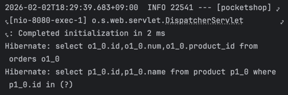
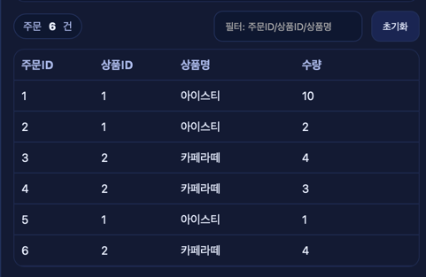
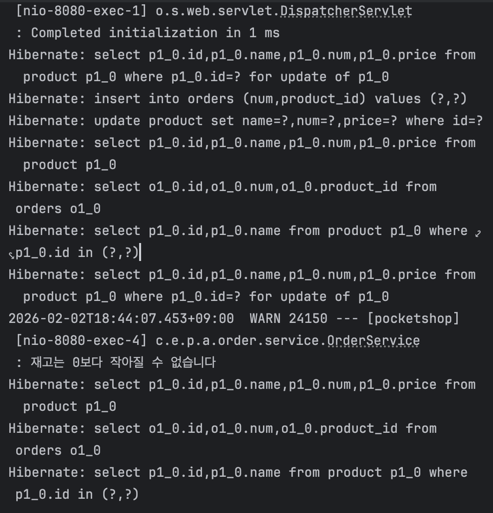

# Pocketshop

상품 등록, 수정, 삭제와 주문 생성 및 재고 차감을 처리할 수 있는 간단한 상품·주문 관리 서비스입니다.

## 프로젝트 개요

- 진행 기간: 3일
- 프로젝트 형태: 개인 프로젝트
- 목표:
  - 상품과 주문의 기본 흐름을 직접 구현하며 Spring Boot 기반 백엔드 구조를 익히는 것
  - 주문 생성 시 재고 차감이 함께 이루어지는 핵심 비즈니스 로직을 구현하는 것
  - 프론트 화면과 백엔드 API를 연결하여 전체 동작 흐름을 확인하는 것

## 서비스 소개

Pocketshop은 상품과 주문을 함께 관리할 수 있는 간단한 쇼핑 서비스입니다.

사용자는 상품을 등록하고 조회할 수 있으며, 상품 정보를 수정하거나 삭제할 수 있습니다. 또한 특정 상품에 대해 주문을 생성할 수 있고, 주문이 발생하면 해당 상품의 재고가 차감되도록 구현했습니다. 프론트엔드에서는 상품 목록, 주문 목록, 필터 검색, 선택 기반 입력 보조 기능을 제공하여 단일 페이지에서 전체 흐름을 테스트할 수 있도록 구성했습니다. :contentReference[oaicite:0]{index=0}

## 맡은 역할

- 백엔드 API 개발
- 상품 및 주문 도메인 설계
- 주문 생성 시 재고 차감 로직 구현
- JPA 기반 데이터 접근 계층 구현
- 프론트엔드와 백엔드 연동
- 로그를 통한 동작 흐름 확인 및 디버깅

## 담당 기능 상세

### 1. 상품 관리 기능

- 상품 등록 API 구현
- 상품 전체 조회 API 구현
- 상품 수정 API 구현
- 상품 삭제 API 구현
- 상품명, 가격, 재고를 기반으로 상품 데이터를 관리하도록 구성함 :contentReference[oaicite:1]{index=1} :contentReference[oaicite:2]{index=2} :contentReference[oaicite:3]{index=3} :contentReference[oaicite:4]{index=4} :contentReference[oaicite:5]{index=5}

### 2. 주문 관리 기능

- 주문 생성 API 구현
- 전체 주문 조회 API 구현
- 주문 데이터와 상품명을 함께 내려주기 위한 응답 DTO 구성
- 주문 목록 조회 시 상품 ID만 있는 주문 데이터에 상품명을 매핑하여 응답하도록 구현함 :contentReference[oaicite:6]{index=6} :contentReference[oaicite:7]{index=7} :contentReference[oaicite:8]{index=8} :contentReference[oaicite:9]{index=9} :contentReference[oaicite:10]{index=10}

### 3. 재고 차감 비즈니스 로직

- 주문 생성 시 상품을 조회한 뒤 재고를 차감하도록 구현
- 재고가 부족한 경우 주문을 저장하지 않고 경고 로그를 남기도록 처리
- 동시에 여러 요청이 들어오는 상황을 고려해 상품 조회 시 비관적 락을 적용함 :contentReference[oaicite:11]{index=11} :contentReference[oaicite:12]{index=12}

### 4. 단일 페이지 기반 관리 화면 구성

- 상품 목록과 주문 목록을 한 화면에서 조회 가능하도록 구성
- 상품 선택 시 수정, 삭제, 주문 입력 필드가 자동으로 채워지도록 구현
- 필터 검색, 예시 데이터 입력, 로그 출력 기능을 추가해 테스트 편의성을 높임 :contentReference[oaicite:13]{index=13}

## 기술 스택

- Language: Java
- Framework: Spring Boot
- Database Access: Spring Data JPA
- Validation: Jakarta Validation
- Database: MySQL
- Frontend: HTML, CSS, JavaScript
- Build Tool: Gradle
- 기타: Lombok

## 기술적 의사결정

### 왜 상품과 주문 도메인을 분리했는가

상품과 주문은 서로 밀접하지만 역할이 다르기 때문에 별도 엔티티와 별도 서비스로 나누어 관리했습니다. 상품은 가격과 재고를 관리하고, 주문은 어떤 상품을 얼마나 주문했는지를 기록하는 역할에 집중하도록 설계했습니다. 이를 통해 기능 책임이 명확해지고, 이후 주문 정책이나 상품 정책이 확장될 때도 변경 범위를 줄일 수 있도록 했습니다. :contentReference[oaicite:14]{index=14} :contentReference[oaicite:15]{index=15} :contentReference[oaicite:16]{index=16} :contentReference[oaicite:17]{index=17}

### 왜 주문 생성 시 비관적 락을 사용했는가

주문 생성은 단순 저장이 아니라 재고 차감까지 함께 이루어지는 작업입니다. 여러 사용자가 동시에 같은 상품을 주문하면 재고가 음수가 되는 문제가 생길 수 있기 때문에, 상품 조회 시 `PESSIMISTIC_WRITE` 락을 걸어 재고 변경 시점의 정합성을 확보하려고 했습니다. :contentReference[oaicite:18]{index=18} :contentReference[oaicite:19]{index=19}

### 왜 주문 조회 응답을 별도 DTO로 구성했는가

주문 엔티티에는 상품명 정보가 없기 때문에, 화면에서 바로 사용할 수 있는 형태로 데이터를 가공해 내려줄 필요가 있었습니다. 그래서 주문 목록 조회 시 주문 데이터와 상품명을 조합한 `OrderDetail` DTO를 만들어 응답하도록 구성했습니다. 이를 통해 프론트엔드가 필요한 데이터를 바로 사용할 수 있도록 했습니다. :contentReference[oaicite:20]{index=20} :contentReference[oaicite:21]{index=21} :contentReference[oaicite:22]{index=22}

## 문제 해결 경험

### 문제

주문 데이터에는 상품 ID만 저장되어 있어 주문 목록 화면에서 상품명을 바로 보여줄 수 없었습니다.

### 해결

주문 전체 조회 시 먼저 주문 목록을 조회하고, 주문에 포함된 상품 ID 목록을 모은 뒤 상품 ID와 상품명을 조회하여 Map으로 변환했습니다. 이후 각 주문을 순회하면서 상품명을 포함한 DTO를 구성해 응답하도록 했습니다. :contentReference[oaicite:23]{index=23} :contentReference[oaicite:24]{index=24}

### 결과

프론트엔드에서는 추가 가공 없이 주문 ID, 상품 ID, 상품명, 수량을 한 번에 표시할 수 있게 되었고, 화면 렌더링과 데이터 사용이 더 단순해졌습니다. 주문 목록에서도 실제로 상품명이 함께 표시되는 것을 확인할 수 있습니다. :contentReference[oaicite:25]{index=25}

## 트러블슈팅

### 1. 재고가 0보다 작아질 수 있는 문제

#### 문제

주문 생성 시 단순히 주문 데이터만 저장하면 재고 관리가 되지 않아, 같은 상품에 대해 여러 주문이 들어왔을 때 재고가 실제보다 많이 판매되는 문제가 발생할 수 있었습니다.

#### 원인

주문과 재고 차감이 함께 처리되지 않거나, 동시에 여러 요청이 들어올 경우 같은 재고 값을 기준으로 중복 계산될 수 있기 때문입니다.

#### 해결

주문 생성 로직 안에서 상품을 먼저 조회하고 재고를 차감한 뒤 주문을 저장하도록 처리했습니다. 또한 상품 조회 시 비관적 락을 적용하여 동시에 같은 상품을 수정하는 상황을 제어했습니다. 재고가 부족하면 경고 로그를 남기고 주문 저장을 중단하도록 구성했습니다. :contentReference[oaicite:26]{index=26} :contentReference[oaicite:27]{index=27}

#### 배운 점

주문 기능은 단순 CRUD가 아니라 데이터 정합성이 핵심인 로직이라는 점을 배웠습니다. 특히 재고처럼 동시성 이슈가 발생할 수 있는 값은 트랜잭션과 락 전략을 함께 고려해야 안정적으로 처리할 수 있다는 점을 확인했습니다.

### 2. 주문 목록에 상품명을 함께 보여줘야 하는 문제

#### 문제

주문 엔티티에는 상품 ID만 저장되어 있기 때문에, 화면에서 상품명을 함께 보여주기 어려웠습니다.

#### 원인

주문과 상품이 직접 객체 연관관계로 연결된 구조가 아니라, 주문이 상품 ID만 보유하는 형태였기 때문입니다.

#### 해결

주문 목록 조회 후 상품 ID를 모아 한 번 더 조회하고, 조회 결과를 `productId -> productName` 형태의 Map으로 변환한 뒤 응답 DTO를 생성했습니다. 이를 통해 프론트엔드에 화면 친화적인 데이터를 제공할 수 있었습니다. :contentReference[oaicite:28]{index=28} :contentReference[oaicite:29]{index=29}

#### 배운 점

엔티티 구조와 화면 응답 구조는 동일하지 않을 수 있으며, 실제 서비스에서는 화면 요구사항에 맞는 별도 DTO 설계가 중요하다는 점을 배웠습니다.

### 3. 프론트엔드 테스트 편의성 개선

#### 문제

상품 등록, 수정, 삭제, 주문 생성 기능을 반복해서 테스트할 때 입력값을 매번 수동으로 넣는 과정이 번거로웠습니다.

#### 원인

API는 동작하지만 테스트용 관리 화면에서 입력 편의 기능이 부족하면 전체 흐름을 빠르게 검증하기 어려웠기 때문입니다.

#### 해결

단일 페이지에 상품/주문 목록 조회, 선택 버튼, 필터, 예시 입력, 로그 확인 기능을 추가했습니다. 상품을 선택하면 수정·삭제·주문 입력 필드가 자동으로 채워지도록 하여 반복 테스트를 쉽게 만들었습니다. :contentReference[oaicite:30]{index=30}

#### 배운 점

기능 구현뿐 아니라 직접 검증하기 쉬운 관리 화면이나 보조 UI를 함께 만드는 것도 개발 효율을 크게 높여준다는 점을 느꼈습니다.

## 회고

- 잘한 점
  - 상품과 주문을 분리하여 각 도메인의 책임을 비교적 명확하게 나누려고 했음
  - 주문 생성 시 재고 차감과 동시성 문제를 고려하여 비관적 락을 적용한 점이 좋았음
  - 단순 API 구현에서 끝나지 않고 프론트 화면까지 연결하여 실제 동작 흐름을 직접 확인할 수 있도록 구성한 점이 의미 있었음

- 아쉬운 점
  - 재고 부족 상황에서 예외를 명확히 반환하기보다 로그만 남기고 종료하고 있어, 클라이언트 입장에서 실패 원인을 알기 어려운 구조임
  - 테스트 코드, 공통 예외 처리, API 응답 표준화 같은 부분은 아직 부족함
  - 주문과 상품의 관계를 더 풍부하게 설계하거나, 삭제 정책과 검증 로직을 더 보강할 여지가 있음

- 다음에 개선할 점
  - 재고 부족, 상품 없음, 잘못된 요청값 등에 대해 명확한 예외 응답 구조를 도입할 예정임
  - 테스트 코드를 추가하여 상품/주문의 핵심 비즈니스 로직을 자동 검증할 예정임
  - 주문 상태, 사용자 개념, 결제 흐름 등을 확장하여 실제 쇼핑몰에 가까운 구조로 발전시킬 예정임

## 주문 목록 조회를 실행하신 후 실행 응답

## 재고 1인 상품에 대해 주문을 2번 시도했을 때 결과

